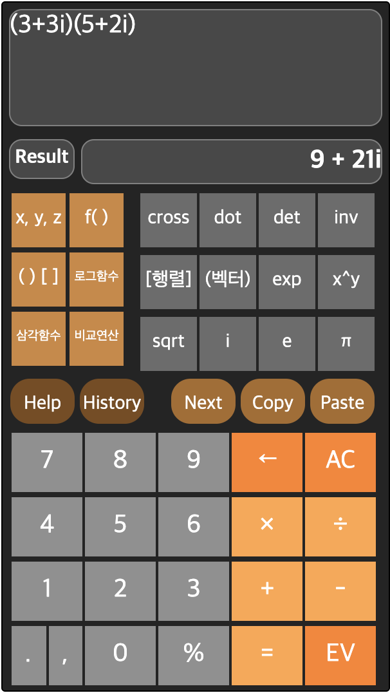

## Engineering Calculator (공학용 계산기)

&nbsp;&nbsp;&nbsp;&nbsp;&nbsp;&nbsp;&nbsp;&nbsp;&nbsp;&nbsp;&nbsp;&nbsp;&nbsp;&nbsp;&nbsp;&nbsp;&nbsp;&nbsp;&nbsp;&nbsp;&nbsp;&nbsp;&nbsp;&nbsp;&nbsp;&nbsp;&nbsp;&nbsp;&nbsp;&nbsp;&nbsp;&nbsp;&nbsp;&nbsp;&nbsp;&nbsp;&nbsp;&nbsp;&nbsp;&nbsp;&nbsp;&nbsp;&nbsp;&nbsp;&nbsp;&nbsp;&nbsp;&nbsp;&nbsp;&nbsp;&nbsp;&nbsp;&nbsp;&nbsp;&nbsp;&nbsp;&nbsp;&nbsp;&nbsp;&nbsp;*2019-1 휴먼컴퓨터인터페이스 프로젝트*

**웹 기반 GUI 공학용 계산기**

**더 자세한 내용은 report.pdf 파일을 확인해주세요**

 

- **구현한 기능 소개**
  - 정수, 실수, 복소수의 표현과 그 기본 연산(산술연산, 비교연산)
  - 벡터, 행렬의 표현과 그 기본 연산(내적, 외적, 행렬의 곱셈, 역행렬, 행렬식)
  - 자주 사용되는 상수(PI, e) 및 함수 지원(sin, cos, tan, exp, log, sqrt)
  - 변수, 함수 정의 및 사용
  - 도움말 - 인터페이스 사용법 설명
  - 벡터, 행렬 입력 간소화 - 괄호 쌍 입력의 불편함 최소화
  - 복사 & 붙여넣기 - 일부 영역 선택하여 보관 및 재사용
  - 히스토리 - 과거 입출력 내역의 확인 및 재사용

 

- **사용한 언어 및 도구, 라이브러리**
  
  + HTML, CSS, Javascript
  
  + math.js
  
     

+ **개발 환경**
  + macOS Mojave
  + Visual Studio Code
  + Chrome

 

- **실행 URL**

  + https://hongchan2.github.io/calc/1/
  
    
  
- **시연 영상**

  + https://youtu.be/GxthLSBSnFQ
  
  
  
- **스크린샷**

  </img>

  

---

> 2019.11.5 최종 업데이트
>
> 광운대학교 소프트웨어학부 윤홍찬

